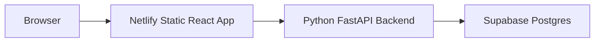

# Deployment Module Design

## Goal

Add a deployment readiness Module for 经史舆图 so the React frontend can keep deploying on Netlify while the Python backend can be deployed separately against Supabase/Postgres with explicit environment checks.

## Scope

- Keep Netlify as a static Vite/React frontend host.
- Keep the Python backend platform-neutral: any host that can run `uvicorn api.app:app` with environment variables should work.
- Add a backend deployment readiness Interface that validates production-critical configuration without exposing secrets.
- Add a CLI check so deployment jobs can fail fast before starting the backend.
- Document the required frontend/backend environment variables.
- Add Netlify headers suitable for a static SPA.

## Out Of Scope

- Creating or linking real Netlify/Supabase projects.
- Choosing a Python hosting vendor.
- Running database migrations. That belongs to the next Database Migration Module.
- Moving the Python backend into Netlify Functions.

## Deployment Shape



Frontend deployment:

- Netlify builds `app/` with `npm run build`.
- Netlify serves the Vite static output from `app/dist`.
- `VITE_API_BASE_URL` points to the deployed Python backend origin.

Backend deployment:

- Backend host installs `backend/requirements.txt`.
- Runtime command uses `uvicorn api.app:app`.
- Environment includes `DATABASE_URL`, `JWT_SECRET`, and `CORS_ORIGINS`.

## Backend Interface

New pure Module:

- `backend/api/deployment.py`

It exposes:

- `deployment_report(env)` returning a structured report.
- `deployment_is_ready(report)` for command and route callers.

New route:

- `GET /api/deployment/readiness`

The route returns:

```json
{
  "ready": false,
  "checks": [
    {
      "id": "jwt_secret",
      "ok": false,
      "message": "JWT_SECRET must be set to a non-default value"
    }
  ]
}
```

The route must not return secret values.

New CLI:

- `PYTHONPATH=backend python -m api.deploy_check`

The CLI prints the same JSON report and exits non-zero when deployment-critical checks fail.

## Checks

- `DATABASE_URL` must be set.
- Production deployment must not use SQLite.
- `JWT_SECRET` must be set and must not be `dev-only-change-me`.
- `CORS_ORIGINS` must be set to explicit origins in production.

## Tests

- Default local env reports not ready for production.
- Postgres URL, strong JWT secret, and explicit CORS origins report ready.
- CLI exits `1` when not ready and `0` when ready.
- Readiness route returns the structured report.
